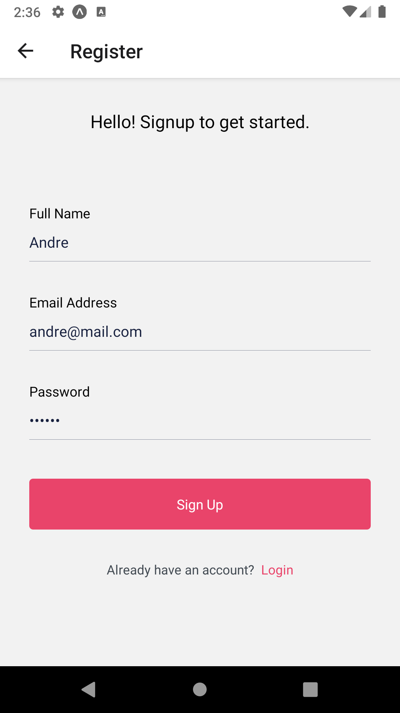
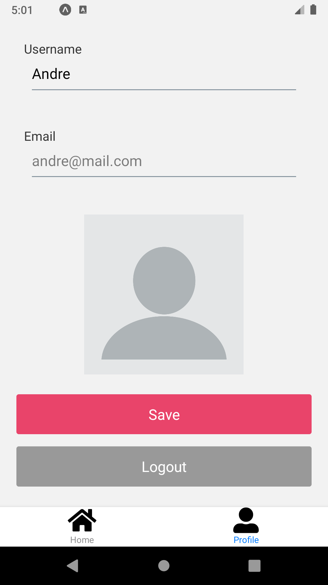
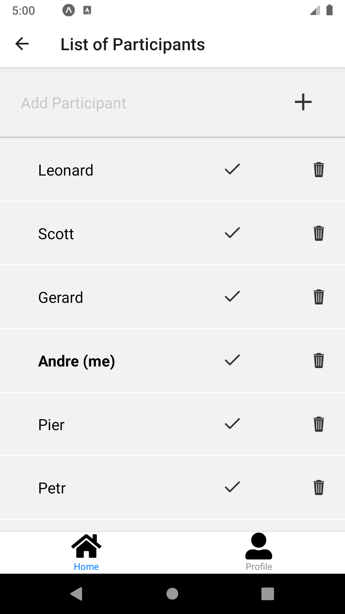

# RapidTrip

RapidTrip helps you coordinating car trips with your friends. Not sure who should be travelling in whose's car in the next trip? Or which driver will be the closest one with available spots in his car? Let us do the math for you! Through our optimization algorithm, we try to pick the best car allocation, minimizing travelling times for everyone and providing a stress free trip.

## The project

This app was developed as part of a Thesis Project for a software engineer bootcamp.

## Tech Stack

### Front-End

- React Native with Expo CLI

### Back-End

- Node.js with Koa framework
- PostgreSQL with Sequelize ORM

### External APIs

- Firebase Authentication
- Google Maps and Places APIs
- Cloudinary (picture storage)

## Installation

This procedure describes how to launch the application in a development or testing environment, with client and server on the same machine.

1. Clone the repository
2. run 'npm install' in the _root_ of the project as well as in the _server_ directory
3. run 'expo install' in the _client_ directory
4. Set up the environment variables in the server
5. Set up the environment variables in the client
6. Launch the database
7. Launch the server by running 'npm start'
8. Launch the client by running 'expo start'
9. Pick your device (either real device through QR code or with Android emulator / XCode simulator)

## How it Works

1. The User fist signs in/up unless he has recently authenticated - in that case he directly lands on the app's home page (step 2).
   
   

2. The User can check which trips he is a member of.

   
   

3) By clicking on a trip, the user can access a menu with different details about the trip:
   
   

4) The user who created the group is the only one allowed to run the algo. As long as it has not been run, the other members must wait for the car allocation.
   

5) When all participants of a group have provided their departure time and location, the user who created the trip can run the algorithm. All users can then check the results on the Car Allocation page.
   

## Contributors

- [Nicole Carrion Cogo](https://github.com/nicolecogo)
- [Brendan Garvey](https://github.com/Brendan-G5)
- [Anthony Candaele](https://github.com/acandael)
- [Virginie Auguste](https://github.com/Sipann)
